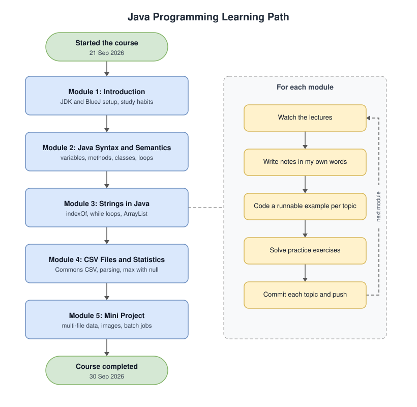

# Java Certification Learning

My notes, code and practice from the **Java Programming: Solving Problems with Software** certification course by Duke University on Coursera.

I use this repo for revision: notes for every lecture, my own runnable examples, practice problems and a mini project. Later I plan to extend it for DSA and interview prep.

## Certificate

**Java Programming: Solving Problems with Software**, Duke University (Coursera). Completed 30 September 2026.

- [View certificate](https://coursera.org/share/0bc6cb434b85ae82dfc7e7a2a60ea530)
- [Verify on Coursera](https://www.coursera.org/account/accomplishments/verify/RCPO2P559H2S)

## Highlights

- **5 modules, every lecture covered.** Each module README lists its notes in the same order as the course videos.
- **Runnable code for every topic.** 20+ examples, each with its own `main`, all tested.
- **Original practice.** 16 exercises with solutions across modules 2 to 4, using my own problems and data.
- **Mini project: [Library Checkouts](projects/library-checkouts).** Analyses a set of yearly CSV files: totals, top titles per genre, trends across years and the busiest genre.
- **Real data handling.** CSV parsing with Apache Commons CSV, missing values (`N/A`), bad rows and multiple files.
- **Image processing.** Batch brighten and black-and-white effects using plain Java `BufferedImage`.
- **Built topic by topic.** Every topic is its own commit, so the history follows the course.

## Timeline

- **Started the course:** 21 September 2026
- **Completed the course:** 30 September 2026
- **This repository:** put together on 29 and 30 September 2026, one topic per commit, as I went back through each module and wrote up my notes and code



The diagram is a draw.io file ([`docs/learning-flow.drawio.svg`](docs/learning-flow.drawio.svg)), so it can be opened and edited directly in [draw.io](https://app.diagrams.net).

## Structure

The course has 5 modules. Each module has its own folder, and projects go in `projects/`.

```
Java-Certification-Learning/
├── README.md
├── Assignments/     Assignment answers and data
├── docs/            learning path flowchart
├── module-01/       Introduction to the Course
├── module-02/       Fundamental Java Syntax and Semantics
├── module-03/       Strings in Java
├── module-04/       CSV Files and Basic Statistics
├── module-05/       MiniProject: Baby Names
└── projects/
    └── library-checkouts/
```

Inside a module folder there is usually a `README.md`, `notes/`, `examples/` and `exercises/`. Not every module needs all of them. Each module README lists its notes in the same order as the lectures.

## Progress

- [x] Module 1 - Introduction to the Course
- [x] Module 2 - Fundamental Java Syntax and Semantics
- [x] Module 3 - Strings in Java
- [x] Module 4 - CSV Files and Basic Statistics
- [x] Module 5 - MiniProject: Baby Names

## Topics covered

- **Module 1:** setting up the JDK and BlueJ, compiling and running from the terminal, study habits, asking for help
- **Module 2:** variables and types, operators, methods, conditionals, classes and objects, loops, the seven-step problem solving approach
- **Module 3:** string methods and positions, `indexOf` with `while` loops, the Math class, logical operators, separation of concerns, storing results in an ArrayList, debugging
- **Module 4:** CSV files with Apache Commons CSV, filtering rows, converting strings to numbers, finding the maximum with `null`, processing multiple files, refactoring
- **Module 5:** CSV files without a header, working across many yearly files, images as pixels, batch processing and saving files

## Projects

- [Library Checkouts](projects/library-checkouts): analyses yearly checkout files for a made-up library, with yearly totals, the top title per genre, trends across years and the busiest genre

## Practice

Modules 2 to 4 each have an `exercises/` folder with problems I wrote to practise that module's topics, along with my solutions. Module 5's practice is the Library Checkouts project.

The course's graded programming assignments are not included here. The exercises use the same techniques on different problems and data.

## Running the code

Every example has its own `main` and runs with `java FileName.java` (Java 11+). The CSV examples in modules 4 and 5 also need the Apache Commons CSV jar:

```
java -cp commons-csv-1.10.0.jar examples/HighestSales.java
```

## Useful resources

- [Java SE documentation](https://docs.oracle.com/en/java/javase/)
- [Java language tutorials](https://docs.oracle.com/javase/tutorial/)
- [Apache Commons CSV](https://commons.apache.org/proper/commons-csv/)
- [draw.io](https://app.diagrams.net)
